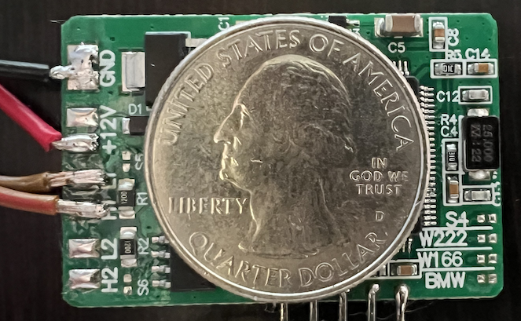
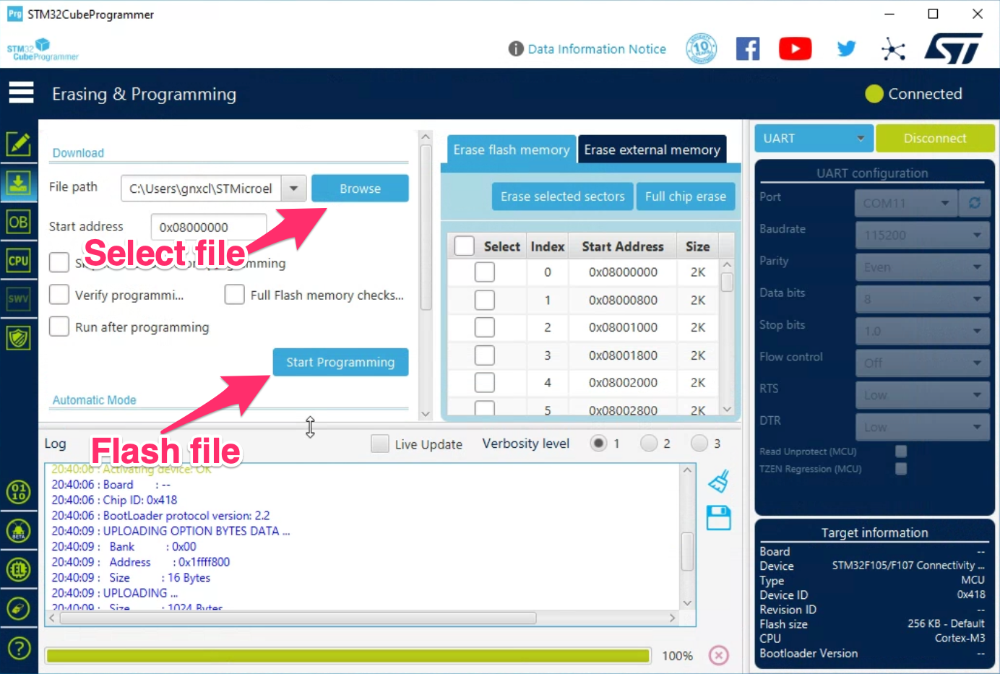
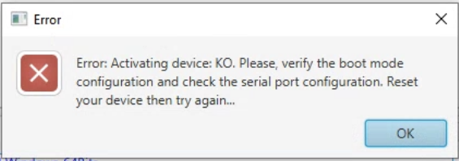

### Spoof a healthy BCM/BNS on the R230 CAB-B bus to extinguish the read battery warning from the instrument panel.

## Green Board

## Programming

Connect an FTDI USB serial interface to the pads  as seen in the photo.

Use STM32Prg to flash the firmware. 

The first time you press connect, you may see this error. Just keep trying. I always see it at least once.

