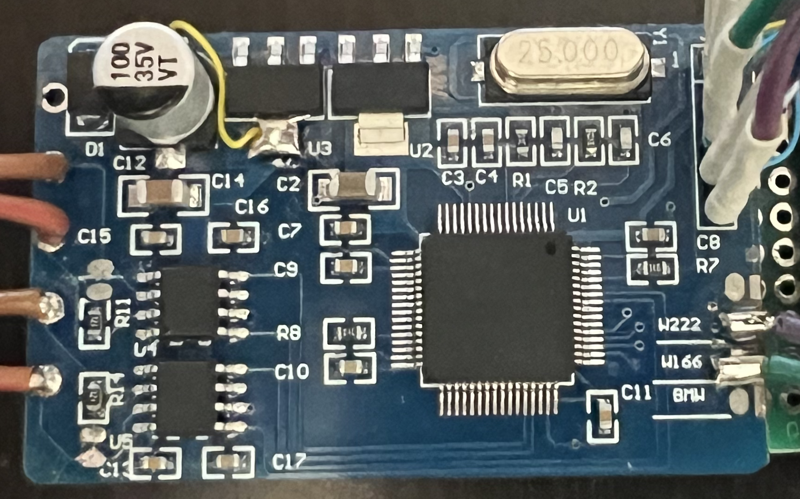
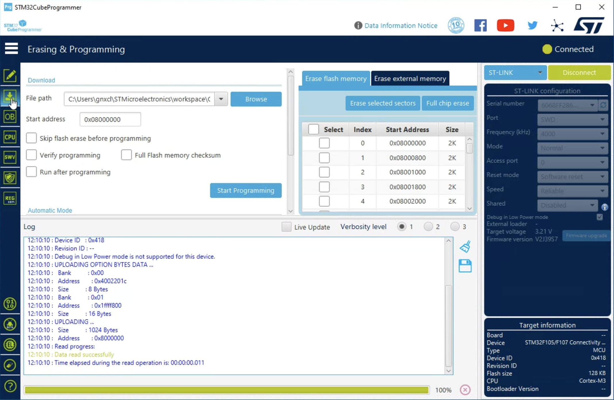

# Spoof a healthy BCM/BNS on the R230 CAN-B bus to extinguish the read battery warning from the instrument panel.

## Boards

I have experimented with several types of boards, all available from AliExpress. The boards are all based on the STM32F105 microcontroller. The boards are all similar in design and function. The boards are available in green, blue and black.  

All boards arrive with 120ohm terminating resistors on the CAN bus. Remove the resistors or remove any solder blobs which enable them. Be sure to connect CAN 1 to the CAN-B bus. CAN 2 is not used in this implementation.

### Green Board

This is the recommended board. The advantage to this particular one, with the 100 pin STM32F105VCT6 MCU, is that it consumes less than 20mA when idle. The other boards consume 40mA when idle. This is important when the board is powered by the consumer battery when parked and off. This MCU also has 256kB. Not important for this application, but could be handy if you want to make a CAN gateway, MITM CAN spy, etc. This board has configurable terminating resistors, you can de-solder the shorting blobs to disconnect the resistors. So far, all green boards have serial programming pads and therefore require the use of an FTDI adapter or similar. Boot0 must be pulled high at power up to place it into flash programming mode.

### Smaller Green Board

This is a smaller green board. It has a 64 pin STM32F105RBT6 MCU. This board has its serial programming pads on the back. Flashing has the same requirements as the larger green board.

The neat thing about this smaller green board is that it has a built-in red LED. This LED can be used to indicate the status of the board. (ie: If it is actively communicating on the CAN bus) This board also has 256kB of flash.

### Blue Board

This board is similar to the green boards, except it has different programming requirements. This one exposes the SWDIO, SWCLK and BOOT0 pins for programming. Ensure BOOT0 is pulled high (3.3v) at power up to place it into flash programming mode.

This board does not expose USART1 pins, but you can get USART3 on the W222 and W166 config pads. You can see I have wires soldered on here. For strict use as a BNS emulator, this is not required.

### Black Board

This board is very similar to the blue board in-that it also exposes the SWDIO, SWCLK pins for programming. However, this board doesn't expose the BOOT0 pin. This makes programming the black board a bit more challenging. Again, BOOT0 must be pulled high at power up to place it into flash programming mode. To accomplish this, I manually held a wire to bring BOOT0 high as I plugged the ST-LINK into the USB port. I was not able to connect to the board without doing this. The reason is, the stock firmware the board arrives with remaps the SWCLK pin as a GPIO input. Holding BOOT0 high at power up boots the MCU into the bootloader vs the stock firmware such that the SWCLK pin is not remapped.

Once the board is re-flashed, you won't need to hold BOOT0 high again. When the board boots with the new firmware provided here, SWCLK will remain available.

## Programming

Use STM32Prg to flash the firmware. Use the `CANFilterBNSEmulator.bin` file in the `firmware` directory.

### Green board

Connect an FTDI USB serial interface to the pads as seen in the photo.

Make certain the Boot0 pin is getting 3.3V. This will put the MCU into bootloader mode.

Before disconnecting power from the board after flashing, disconnect Boot0 first! This is very important. Failing to do this will wipe the recently flashed firmware image.

The first time you press connect, you may see this error. Keep trying. I always see it at least once.

### Blue and black board

The blue and black boards use an ST-LINK V2 programmer. Connect the ST-LINK to the SWDIO, SWCLK and BOOT0 pins. Ensure BOOT0 is pulled high (3.3v) at power up to place it into flash programming mode.

The black board doesn't expose a pad for BOOT0. You will need to manually hold a wire to bring BOOT0 high as you plug the ST-LINK into the USB port. As seen here:

### Acknowledgments

- **Andras Kabai** for his web page: [Hacking a Mileage Manipulator CAN Bus Filter Device](https://dangerouspayload.com/2020/03/10/hacking-a-mileage-manipulator-can-bus-filter-device/)
- **Elias Kotlyar** for his GitHub repository: [Canfilter](https://github.com/EliasKotlyar/Canfilter)
